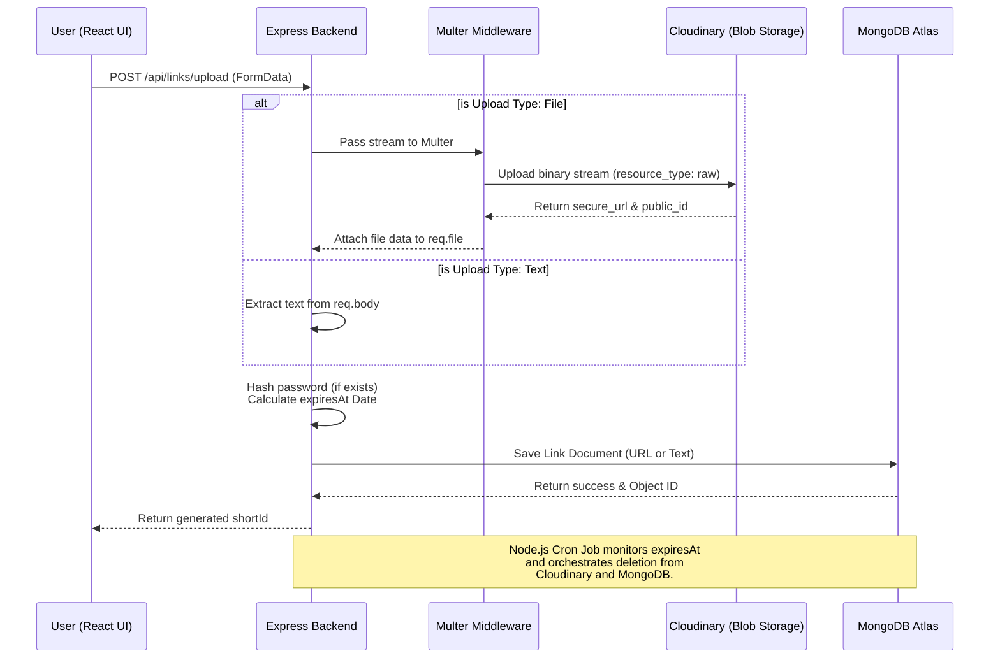
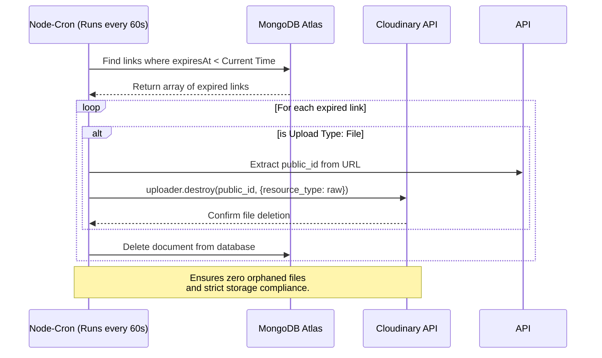

# LinkVault

LinkVault is a full stack application for sharing files and text. It has features like user authentication, file size and type validation, auto expire links with view count, strict access control, password protected links etc.
Here is how to use it.

## Setup Instructions

### Prerequisites
You need Node.js installed on your machine. You will also need accounts for MongoDB Atlas (for the database) and Cloudinary (for file storage).

### 1. Clone and Install
Install the dependencies for both backend and frontend.

```bash
# Setup Backend
cd backend
npm install

# Setup Frontend
cd ../frontend
npm install
```
 ##  Repository Structure

```text
LinkVault/
├── backend/
│   ├── models/
│   │   ├── Link.js          
│   │   └── User.js          
│   ├── routes/
│   │   ├── authRoutes.js    # Endpoints for login & registration
│   │   └── linkRoutes.js    # Endpoints for upload, validation, & retrieval
│   ├── cron.js              # Cloudinary/DB cleanup
│   ├── index.js             # server entry point
│   ├── package.json
│   └── .env                 
├── frontend/
│   ├── src/                 # React components, pages, and API logic
│   ├── public/              
│   ├── package.json
│   ├── tailwind.config.js   
│   └── vite.config.js       
├── .gitignore               
├── README.md                
└── schema.pdf               
```
### 2. Environment Variables
In the backend directory, create a file named .env and add the following keys. Fill in your own MongoDB URI and Cloudinary credentials.

```bash


PORT=5000
MONGO_URI=your_mongodb_atlas_connection_string
CLOUDINARY_CLOUD_NAME=your_cloud_name
CLOUDINARY_API_KEY=your_api_key
CLOUDINARY_API_SECRET=your_api_secret
JWT_SECRET=any_random_secret_string_for_tokens
```
 
 
### 3. Run the Application
Run both simultaneously

**Terminal 1 (Backend):**
```bash
cd backend
npm run dev
 ```

**Terminal 2 (Frontend):**

```bash
cd frontend
npm run dev

```

The application will be available at `http://localhost:5173`.

---

## API Overview

Here is a high-level overview of the REST API which is designed for this project.

### Auth Routes

* **`POST /api/auth/register`** - Accepts the username and password, hashes the password using bcrypt before storing it, and creates the user securely.
* **`POST /api/auth/login`** - Authenticates the user and returns a stateless JWT token for session management, keeping the server lightweight and highly scalable

### Link Management Routes

* **`POST /api/links/upload`** : APIs use separate endpoints for authenticated and guest uploads. But duplicate routes clutter the codebase. That is why a single unified route is used to handle both `raw text` and `multipart/form-data`. It checks for a `JWT token`, if present it attaches the ownerId so the document can be managed later. If missing, it seamlessly processes the request as an anonymous upload.


* **`POST /api/links/:shortId`**: By REST conventions fetching data should be a `GET` request. But sending passwords via GET exposes them in the URL. That is why a `POST` request is used instead. It securely verifies the password hidden in the request body, and strictly checks if the link is expired or has reached its `max view limit` before returning the content.


* **`GET /api/links/user/dashboard`**
Enforces a valid JWT. It extracts the logged-in user's ID to query and return only their active links, ensuring strict data isolation

* **`DELETE /api/links/:shortId`**: Check if the user making the request to delete the link is actually the owner of the link before permanently deleting it from database.


---

## Design Decisions :

Here are the design choice I took in this assignment to implement feature efficiently.

### 1. POST instead of GET

BY REST conventions, fetching data should be a `GET` request. But since I implemented the password protected link feature, client need to send password to server and using `GET` to send password is a major flaw. That is why I used `POST` request so that password can be encrypted and hidden inside HTTP request body.

### 2. The Background Deletion Job (Cron vs. TTL)
MongoDB's built-in TTL indexes (expireAfterSeconds: 0) are used for automatic deletion. But because MongoDB's background thread deletes the document silently, the Node.js server is never notified, leaving orphaned binary files on Cloudinary eating up storage quotas. That is why a custom background Cron job using node-cron is implemented. It wakes up every minute, sweeps the database for expired links, securely deletes the file from Cloudinary's servers via API, and then removes the database record, ensuring 100% clean hybrid storage.

### 3. Hybrid Storage (Cloudinary vs. Database)

One might consider storing all uploaded data directly in the database. But since MongoDB uses BSON which has a strict `16MB` document limit, storing binary files directly makes the database bloated and queries extremely slow. That is why I split the storage logic. 

If a user uploads text, it goes straight into `MongoDB`. But if it's a file, I used `multer` to intercept the upload and stream it directly to `Cloudinary`. I only save the resulting secure Cloudinary URL in MongoDB, which keeps the database lightweight and fast

### 4. File Size and Type Validation

By default, an upload endpoint will accept any file sent by the client. But leaving this open means users could upload massive files or malicious scripts, leading to server abuse and rapid storage consumption. That is why I configured the `multer middleware` to strictly reject any file larger than `5MB`. I also added a `fileFilter` to only accept standard, safe file formats `(JPG, PNG, PDF, and TXT)`. This blocks invalid uploads at the middleware level before they can waste server resources or bandwidth.

### 5. Frontend UI/UX Approach

For utility apps, it is common to just use a basic HTML form that displays all input fields at once. But showing both text and file inputs simultaneously clutters the interface, and a basic design doesn't inspire user trust. That is why I used `Tailwind CSS` to build a Glassmorphism UI and implemented conditional rendering. The form dynamically changes based on whether the user selects text sharing or file upload. This keeps the screen clean and easy to understand while making the app feel like a modern, secure SaaS product.


## Assumptions & Limitations
### Assumptions

* **Modern Browsers:** A web app might rely on server-side rendering to support legacy environments. But managing complex UI states on the server is inefficient. That is why the frontend is built entirely on React, assuming end-users will access the application using modern, JavaScript-enabled web browsers.
* **Environment Clocks:** Distributed apps might use logical clocks or client-side time. But for a strict time-based expiry system, using anything other than standard UTC time creates severe vulnerabilities. That is why it is assumed the server running the backend has an accurately synced system clock, as the expiry logic rely heavily on it.
* **Scope of Use:** Generally, file-sharing platforms allow massive uploads to accommodate all user needs. But allowing large-scale video or raw data hosting leads to rapid storage exhaustion and high bandwidth costs. That is why the system assumes a `5MB` file limit is sufficient. It is strictly designed for quick document and snippet sharing.

### Limitations

* **Background Job Sweep Timing:** It is expected that an expired document vanishes the exact millisecond time runs out. But constantly polling the server for exact-millisecond deletions is highly inefficient and drains system resources. That is why the background Cron job is configured to run only once every 60 seconds. As a result, while the API logic strictly denies user access the exact millisecond a link expires (returning a 403 error), the actual physical deletion of the file from Cloudinary and the database might lag by up to a minute.
* **Third-Party Quotas:** An application might store files locally to avoid third-party restrictions. But storing binary files on the server rapidly consumes disk space and hurts scalability. That is why files are streamed to Cloudinary instead. Because of this, the application is inherently limited by Cloudinary's free-tier API rate limits, bandwidth, and storage quotas.
* **No Password Recovery:** Normally, systems include recovery flows to help users regain access to their data. But implementing recovery mechanisms requires storing additional metadata and breaks the concept of a secure, ephemeral vault. That is why the system is designed strictly as a "burn-after-reading" vault. If a password or generated URL is lost, there is absolutely no recovery mechanism.
 


## DataFlow Diagrams

### Pipeline



---------------


### Background Cleanup Flow (Cron Job)





---------------


### Data Retrieval & Security Flow


```mermaid
sequenceDiagram
    participant U as User (React UI)
    participant API as Express Backend
    participant DB as MongoDB Atlas

    U->>API: POST /api/links/:shortId (Sends password if locked)
    API->>DB: Query link by shortId
    DB-->>API: Return Link Document
    
    alt Link Not Found or Past expiresAt
        API-->>U: 403/404 Error (Access Denied)
    else is Password Protected
        API->>API: Compare bcrypt hash
        alt Password Invalid
            API-->>U: 401 Error (Unauthorized)
        end
    end
    
    alt maxViews Limit Reached
        API->>DB: Delete Link (Burn after reading limit hit)
        API-->>U: 403 Error (Link Expired)
    else Valid Request
        API->>DB: Increment viewCount (+1)
        API-->>U: 200 OK (Return Text Payload or Cloudinary URL)

    end
